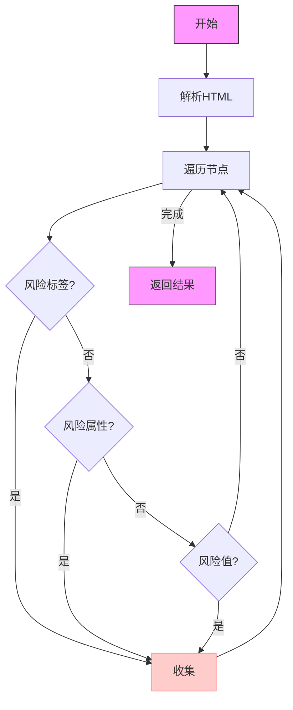

# xss-validator

##### 这是一个后端针对前端提交的富文本类型内容进行XSS检测的小工具。
---
## 背景
记一次项目迭代需对提交的富文本内容进行安全检测，且只需检测文本内容是否包含恶意xss注入代码，
找遍市面上所有开源工具及方案后发现不太满足业务诉求，会将不安全的标签进行清除返回，所以自己写了一个小工具，该小工具只做检测不做文本替换，算提供一种解决的思路。

## 小工具支持能力
|      | 支持方式 |
| ----------- | ----------- |
| 标签      | 支持对html文本标签进行白名单或黑名单拦截配置如：```<a> ``` ```<p> ``` ```<div>```       |
| 标签属性   | 支持对html文本标签里属性进行黑名单拦截配置 如: ``<a onload> <o data>``        |
| 标签属性值   |1) 支持对html文本标签内属性值进行安全检测拦截  如: ```<a herf="javascript">```   |
|     |2) 支持对html文本标签内属性值转码绕过拦截方式进行拦截  如: ```<a herf="\u006a\u0061...">``` ```<a href='&#0000106&#0000097&#0000118...'```   |
|     |3) 支持对html文本标签内属性值穿插\t\n空格等绕过字符串匹配方式拦截  如: ```<a herf="\u006a\u0061...">``` ```<a href='jav\tas\ncript'```   |
|     |4) 支持对html文本标签内属性值混淆绕过检测 如: jsfuck, aaEncode, jjEncode等 |


## 快速接入
- [接入指南](docs/Introduce.md)  


## 代码处理思路

### 1. 解析富文本内容
- 使用 HTML 解析器（如 Jsoup）将富文本内容解析为 DOM 结构。
- 提取所有 HTML 标签和其属性。

### 2. 检查危险标签和属性
- **危险标签**：
    - `<script>`, `<iframe>`, `<frame>`, `<object>`, `<embed>`, `<applet>`, `<meta>`, `<link>`, `<style>` 等。
- **危险属性**：
    - `onload`, `onunload`, `onresize`, `onscroll`, `onfocus`, `onblur`, `onchange`, `onclick`, `ondblclick`,
      `onmousedown`, `onmouseup`, `onmouseover`, `onmouseout`, `onmousemove`, `onkeydown`, `onkeyup`,
      `onkeypress`, `onsubmit`, `onreset`, `onabort`, `onerror`, `onmessage`, `onstorage`, `onsuspend` 等。

### 3. 检测潜在的 XSS 代码
- 检查文本内容中是否包含潜在的 JavaScript 代码：
    - `javascript:`, `alert`, `prompt`, `confirm`, `document`, `window`, `location`, `innerHTML`, `outerHTML`,
      `execScript`, `setTimeout`, `setInterval` 等。
- 检查是否有 Base64 编码的脚本或其他编码方式隐藏的恶意代码。

### 4. 使用白名单机制
- 只允许特定的标签和属性通过，拒绝所有不在白名单中的标签和属性。
    - 示例允许标签：`<p>`, `<br>`, `<b>`, `<i>`, `<u>`, `<a>`, ``, `<div>`, `<span>` 等。
    - 严格限制其属性。

### 5. 检测脚本执行
- 检查是否有 `src` 属性指向外部脚本文件（如 `.js` 文件）。
- 检查是否有 `href` 属性指向恶意 URL。


### 6. 流程图

